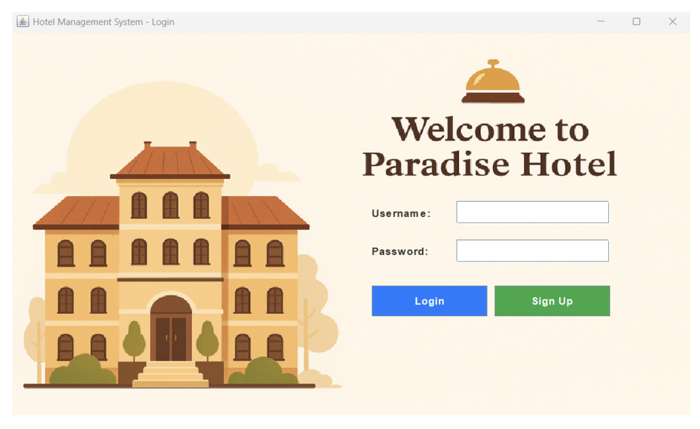
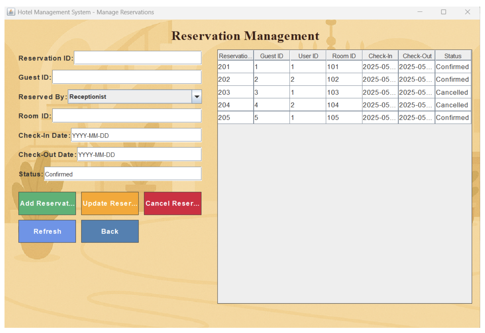
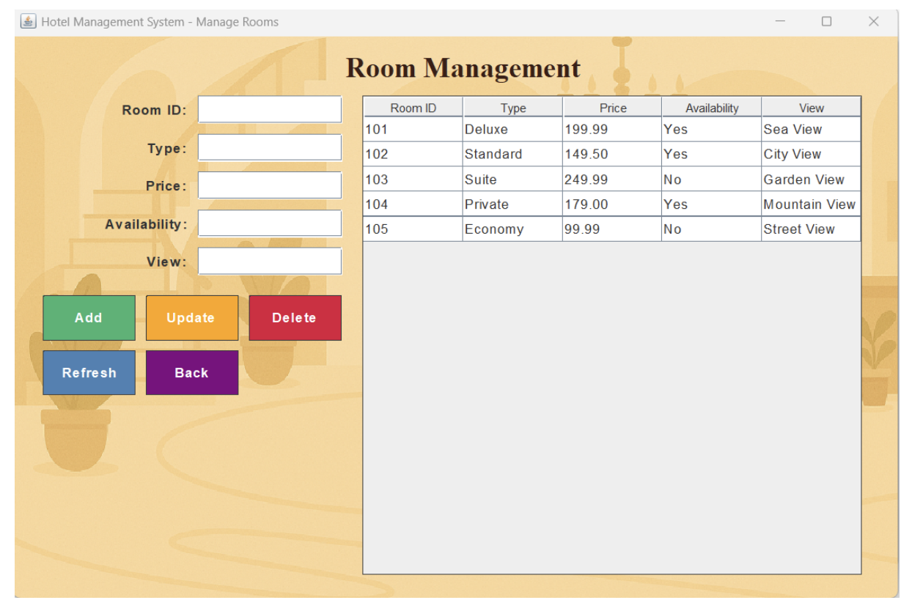

# Hotel Management System

A desktop-based Hotel Management System built using **Java (MVC architecture)** and **Swing UI**.  
The system manages hotel operations including guests, rooms, reservations, services, feedback, and invoices.

> Database structure (ERD + tables + schema mapping) is included in the milestone reports inside `/docs`.  
> SQL script not included since this project focuses on system design and academic implementation.

## ✅ Features
- Login system (Admin, Receptionist, Accountant)
- Guest management
- Room management & availability tracking
- Reservation handling (check-in / check-out)
- Invoice & payment handling
- Services management
- Customer feedback

## 🧩 Architecture (MVC)
| Layer | Description |
|------|------------|
| Model | System data classes (Room, Guest, Reservation, etc.) |
| View | Swing graphical interfaces |
| DAO | Database access logic & functions |

## 🛠 Tech Stack
- Java
- Swing GUI
- MVC + DAO structure
- MySQL DB Design (documented)

## 📂 Project Structure

## 📸 Screenshots

### 🔐 Login Screen

### 📊 Admin Dashboard

### 🛎️ Manage Reservations

### 🏨 Manage Rooms

## 🎯 Notes
This project was developed as part of university coursework for learning Java OOP, GUI programming, and database design.

## 👤 Author
**Alya Wail Shehab**  
Imam Abdulrahman Bin Faisal University  
Course: **CIS 235 – Database Systems**

⭐ **If you found this useful, consider giving the repository a star!**
